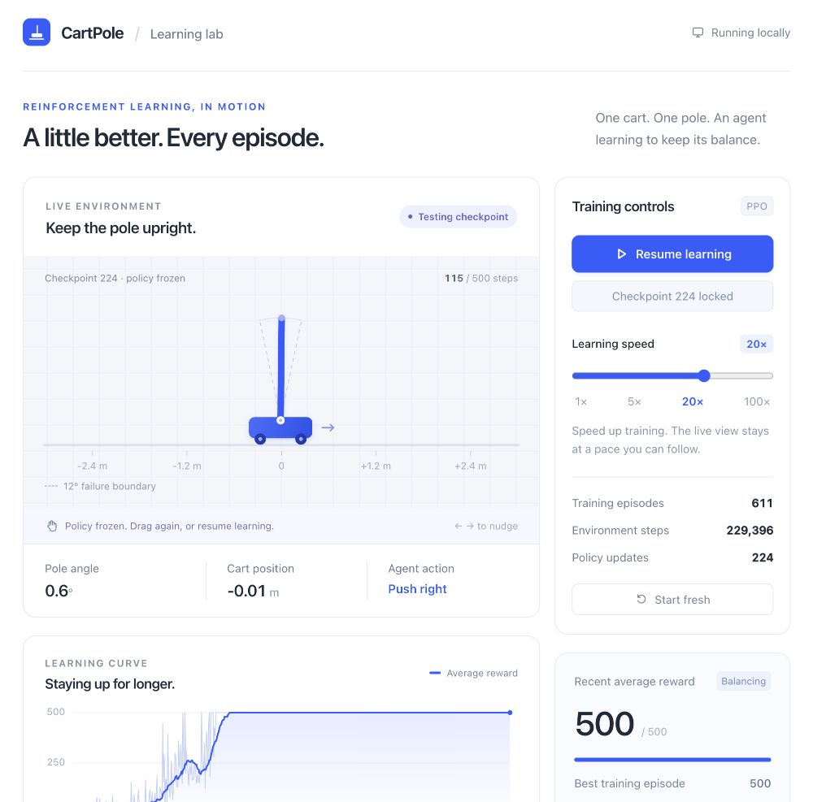
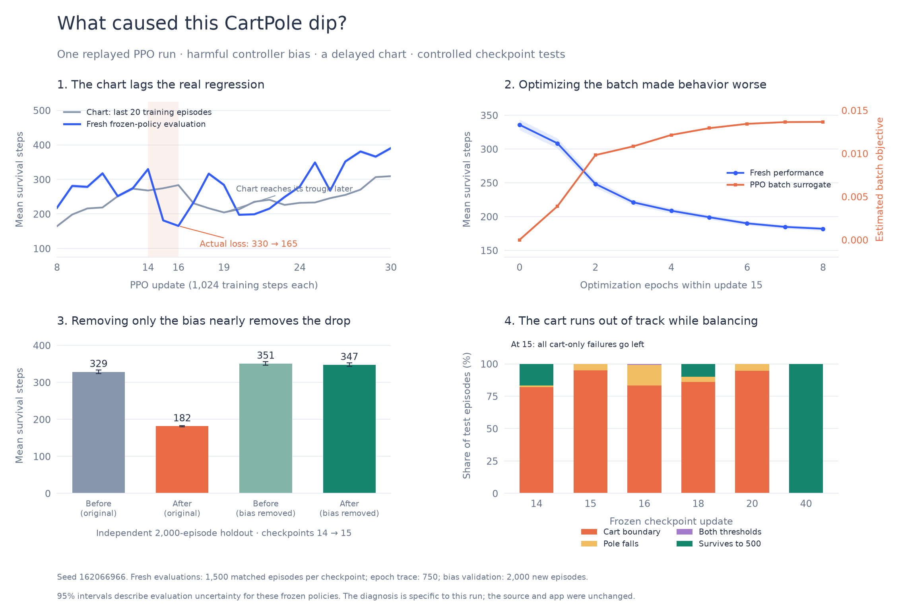

# CartPole learning lab

Watch a real reinforcement learning agent learn to balance a pole. **Drag the cart** to freeze the current policy and test that checkpoint. Wiggle it, release it, and watch the agent respond. Use **Resume learning** to leave checkpoint mode. You can also choose **Test current checkpoint**, then focus the cart view and use the left/right arrow keys for gentle physical nudges. Use **Learning speed** to choose 1×, 5×, 20×, or 100× throughput; pause/resume freezes the learner and live view; **Start fresh** discards the current learner and begins with new random weights.



## Run locally

```sh
git clone https://github.com/ahmed-ela/cartpole-learning-lab.git
cd cartpole-learning-lab
npm start
```

Open http://localhost:5173. Node.js is the only requirement; there are no packages to install. The server binds to the local machine only. Set `PORT` to use another port.

## What you see

- The learner uses PPO with a randomly initialized policy and value network.
- Dragging prescribes cart motion with bounded velocity and acceleration. Its velocity changes apply the corresponding angular impulse to the pole. The agent controls the cart again when released. The pole angle is never scripted. Failed tests reset to a fresh episode of the same frozen checkpoint; a captured drag must be released before reset.
- The cart view runs an independent, real-time episode using the current policy and sampled actions. Training runs in a Web Worker, so increasing speed does not accelerate the cart animation.
- The chart displays actual training episode rewards. Its blue line is the average of the last 20 episodes; the faint line shows individual episode scores.
- 1× means 50 environment transitions per wall-clock second. 20× is the default. Throughput is approximate and can decrease when the browser throttles background tabs.
- Each upright step earns +1. Episodes end beyond 12 degrees of pole tilt, beyond 2.4 meters of cart displacement, or at the 500-step limit.
- Refreshing starts training again. There is no saved model, pretrained policy, server-side training, account, analytics, or external runtime dependency.

## Algorithm

Separate policy and value networks each use four inputs, 32 tanh hidden units, and one output. PPO uses 1,024-step rollouts, generalized advantage estimation (gamma 0.99, lambda 0.95), eight optimization epochs, 64-sample minibatches, 0.2 clipping, an entropy bonus of 0.005, gradient clipping at 0.5, and Adam at 0.001. Rewards are scaled by 0.01 inside value optimization; displayed episode returns remain unscaled.

The physics follows [Gymnasium CartPole](https://gymnasium.farama.org/environments/classic_control/cart_pole/) and its [reference source](https://github.com/Farama-Foundation/Gymnasium/blob/main/gymnasium/envs/classic_control/cartpole.py). PPO follows the [original paper](https://arxiv.org/abs/1707.06347) and [OpenAI's explanation](https://spinningup.openai.com/en/latest/algorithms/ppo.html).

The numerical learner was checked across ten random seeds. After 81,920 environment steps, all ten achieved 500 steps in each of 100 deterministic and 100 sampled evaluation episodes. Learning is not necessarily monotonic, and these tests are not a guarantee for every possible initialization.

## Learning-curve experiments

[Read the measured diagnosis of a learning dip](docs/learning-curves/dip-diagnosis.md). Replaying one representative run showed that a policy update introduced a harmful directional bias: the cart drifted off the track while the pole stayed mostly upright. An independent 2,000-episode controller intervention nearly eliminated the first major regression. The recent-20-episodes chart reported the decline late, after the current policy had begun recovering.



The [experiment overview](docs/learning-curves/README.md) also presents 128 independently seeded learning curves, three representative similarity groups, and evaluation uncertainty. The groups are a descriptive summary, not three universal learning patterns. [Reproduction scripts](experiments/README.md) preserve the exact PPO implementation and seeds; they do not change the interactive app's behavior.

## Source

- `dist/rl.js`: physics, networks, gradients, and PPO.
- `dist/trainer.worker.js`: paced background training.
- `dist/app.js`: controls, live policy view, and reward chart.
- `dist/index.html` and `dist/styles.css`: interface.
- `server.mjs`: dependency-free loopback HTTP server.

Run `npm run check` to check JavaScript syntax. Ctrl+C stops the local server.
