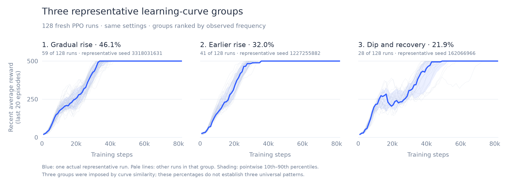
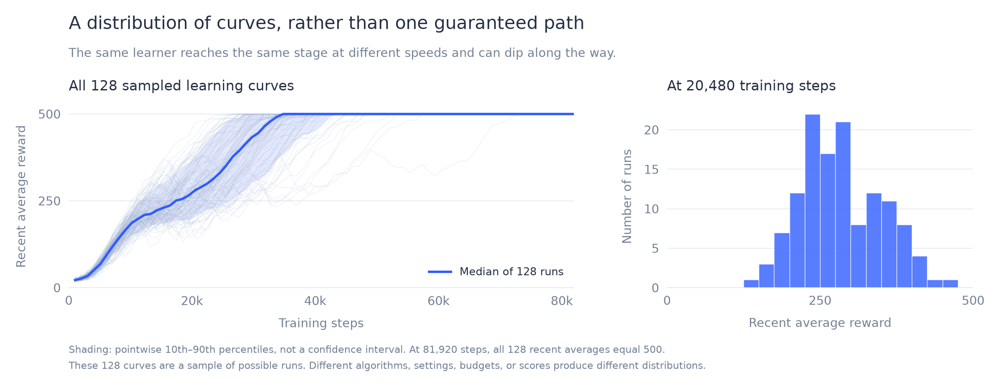

# CartPole learning-curve measurements

The app's recent-20-episodes chart is useful for observing training, but it mixes experience from recent policies. These experiments compare that display with fresh evaluations of fixed checkpoints.

## Diagnosis of a particular dip

[Full diagnosis and methods](dip-diagnosis.md) · [Numeric summaries](dip-diagnosis-data.json) · [SVG figure](dip-diagnosis.svg)

In seed **162066966**, an actor update introduced a harmful constant logit offset. The cart increasingly drifted off the left edge while the pole remained relatively upright. Removing only that offset nearly eliminated the first large before-to-after performance decline in an independent 2,000-episode holdout. PPO's batch objective improved throughout the update, while fresh balancing performance worsened. The displayed moving average reached its trough after the current policy was already recovering.

The experiments identify the behavioral contribution of that offset. They do not uniquely separate sampling error, value/advantage estimation, and optimizer dynamics as the origin of the misleading direction. Smaller actor updates mitigated the tested regression, but did not improve every update. These are results for one selected run, not a universal diagnosis.

## 128 independently seeded runs

Each run used identical default PPO settings for 80 updates, or 81,920 environment transitions. Only the training seed changed. All 128 final recent-20 training means were 500; only seven complete sampled training curves never decreased. Neither result guarantees the behavior of every possible seed.

The blue curves are **medoids**: actual runs chosen to represent whole-curve similarity. They are not averages, medians, or modes. Three groups were imposed using PAM k-medoids with Euclidean distance over 80 aligned recent-20 scores and 32 initialization restarts.

| Representative shape | Assigned runs | Observed share | Representative seed |
|---|---:|---:|---:|
| Gradual rise | 59 | 46.1% | 3318031631 |
| Earlier rise | 41 | 32.0% | 1227255882 |
| Dip and recovery | 28 | 21.9% | 162066966 |

Shares depend on this sample, distance, and imposed group count. They do not establish exactly three natural families or the probability of one exact curve. Pale lines show individual runs; shading shows pointwise 10th–90th percentiles, not a confidence interval for an average.

At 20,480 steps, the overall training-score median was 280.225, with pointwise 10th–90th percentiles 208.685–378.77. At the final horizon, all training means equaled the 500-step ceiling. No universal normal distribution was assumed or fitted.

The [complete ensemble data](../../experiments/curve-analysis/results.json), [compact ensemble summary](../../experiments/curve-analysis/summary.json), and [reproduction instructions](../../experiments/README.md) are included. Confidence intervals for fresh checkpoint evaluation measure episode randomness conditional on those fixed policies, not variation across training seeds.
